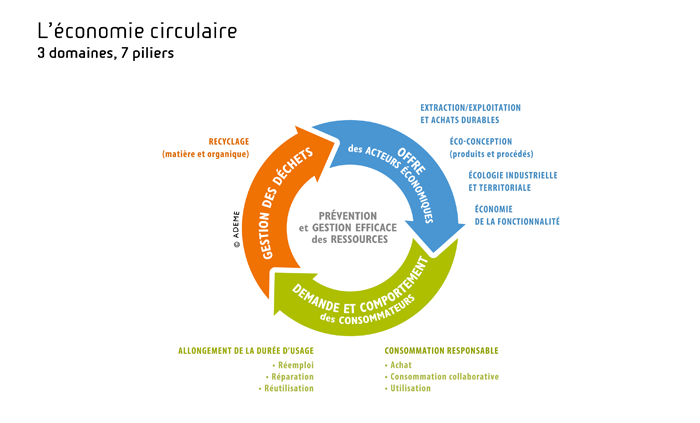

<Hero>

# {{ $page.title }}

## Consultez, téléchargez et réutilisez facilement les données relatives à l’économie circulaire

</Hero>

<Section class="section-color">

## Qu’est ce que l’économie circulaire ?
D’un modèle économique linéaire à une approche circulaire

L'Agence de l'environnement et de la maîtrise de l'énergie définit l’économie circulaire comme un système économique d’échange et de production qui, à tous les stades du cycle de vie des produits, vise à augmenter l’efficacité de l’utilisation des ressources et à diminuer l’impact sur l’environnement tout en développant le bien être des individus

L'économie circulaire se fonde sur trois piliers:
 -  La production et l’offre de biens et de services ;
 -  La consommation au travers de la demande et du comportement du consommateur (économique ou citoyen) ;
 -  La gestion des déchets avec le recours prioritaire au recyclage qui permet de boucler la boucle.

</Section>

<Section class="section-dark">

## Actualité juridique

Le projet de loi anti-gaspillage pour une économie circulaire :

<Button class="large">Découvrir le projet de loi</Button>

</Section>

<Section class="section-grey">

## Les données

</Section>

<Section>

## Soumettre ou demander un nouveau jeu de données

<columns>

Si vous disposez d'un jeu de données relatif à l'économie circulaire, vous pouvez le publier sur data.gouv.fr.

<Button>Publier</Button>

Si vous recherchez des données relatives à l'économie circulaire qui ne sont pas publiées à ce jour, vous pouvez nous faire parvenir votre demande.

<Button>Demander des données</Button>

</columns>

</Section>
